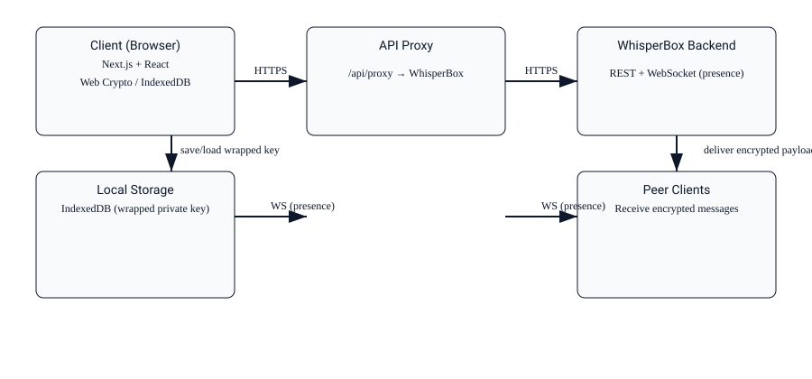

# WhisperBox E2E Chat Application

A secure, end-to-end encrypted messaging application built with Next.js 16, React 19, and TypeScript. Features real-time presence awareness, hybrid encryption (RSA-OAEP + AES-GCM), and WebSocket-based communication with the WhisperBox API.

## Features

- **End-to-End Encryption**: Hybrid encryption using RSA-OAEP for key exchange and AES-GCM for message content
- **Real-Time Presence**: Live online/offline status with WebSocket presence listeners
- **Optimistic UI Updates**: Instant message display with server confirmation
- **Session Management**: Secure HttpOnly cookie-based authentication
- **Key Unlocking**: Encrypted private key storage with password-based unwrapping
- **Conversation Polling**: Automatic conversation list sync every 10 seconds
- **Dark Theme UI**: Tailwind CSS with custom dark color scheme

## Tech Stack

- **Frontend Framework**: Next.js 16.2.3 with App Router
- **UI Library**: React 19.2.4
- **Language**: TypeScript
- **Styling**: Tailwind CSS 4
- **Icons**: Lucide React
- **State Management**: Custom React hooks with reducer pattern
- **API**: REST (via `/api/proxy`) + WebSocket (wss://whisperbox.koyeb.app/ws)
- **Crypto**: Web Crypto API (SubtleCrypto)
- **Database**: IndexedDB (for local key storage)

## Project Structure

```
src/
├── app/
│   ├── api/
│   │   └── auth/              # Auth endpoints (login, logout, register)
│   │   └── proxy/             # API proxy for WhisperBox backend
│   ├── chat/
│   │   ├── layout.tsx         # Chat layout with auth guard & WebSocket setup
│   │   └── [peerId]/page.tsx  # Message view for specific conversation
│   └── page.tsx               # Auth screen
├── components/
│   ├── AuthScreen.tsx         # Login/register UI
│   ├── ChatArea.tsx           # Message list & input
│   ├── Sidebar.tsx            # Conversation list & user menu
│   ├── NewChatModal.tsx       # User search & chat creation
│   ├── ConvoItem.tsx          # Conversation list item with status
│   ├── UserRow.tsx            # User search result row
│   ├── MessageBubble.tsx      # Message display with sending state
│   ├── DateSeparator.tsx      # Message date separator
│   ├── KeySetupOverlay.tsx    # Key generation UI
│   ├── UnlockOverlay.tsx      # Password unlock UI
│   ├── LoadingSpinner.tsx     # Auth check spinner
│   └── Toast.tsx              # Toast notifications
├── hooks/
│   ├── useAppState.tsx        # Central state management
│   ├── useAuthRestore.ts      # Auth guard & session restore logic
│   └── useUnlock.ts           # Password unlock handler
├── lib/
│   ├── api.ts                 # API utility functions
│   ├── crypto.ts              # Encryption/decryption functions
│   └── db.ts                  # IndexedDB key storage
├── utils/
│   └── time.ts                # Time formatting utilities
└── types/
    └── index.ts               # TypeScript type definitions
```

## Getting Started

### Prerequisites

- Node.js 18+ and pnpm

### Installation

```bash
pnpm install
```

### Development

```bash
pnpm dev
```

Open [http://localhost:3000](http://localhost:3000) in your browser. The page auto-reloads as you edit files.

### Linting

```bash
pnpm lint
```

### Build

```bash
pnpm build
pnpm start
```

## Key Components

### Layout System (`src/app/chat/layout.tsx`)

- Auth guard checking valid session & user keys
- Session restore from IndexedDB
- WebSocket presence listener setup
- Unlock overlay for encrypted keys
- Lazy conversation loading with 10s polling

### Chat Area (`src/components/ChatArea.tsx`)

- Message list with optimistic updates
- Real-time presence indicator ("Online" / "Last seen <time>")
- Message input with encryption & send handling
- Auto-scrolling to latest message

### Sidebar (`src/components/Sidebar.tsx`)

- Collapsible conversation list
- Search with contact/global filters
- Online status dots
- User footer with logout

### Custom Hooks

- **`useAppState`**: Global state reducer with auth, keys, conversations, presence
- **`useAuthRestore`**: Session restore & auth guard logic (~50 lines)
- **`useUnlock`**: Password unlock handler with crypto (~55 lines)

### Utilities

- **`time.ts`**: `formatTime()`, `formatTimeFull()`, `formatLastSeen()`, `formatDateSeparator()`
- **`crypto.ts`**: Key generation, encryption, decryption, PBKDF2 wrapping
- **`db.ts`**: IndexedDB setup & private key persistence
- **`api.ts`**: WhisperBox API endpoints

## API Integration

All API calls go through `/api/proxy?path=<endpoint>` to handle CORS and maintain HttpOnly cookies:

- **Auth**: `/auth/me`, `/auth/login`, `/auth/register`, `/auth/logout`
- **Users**: `/users/<id>`, `/users/<id>/public-key`
- **Conversations**: `/conversations`, `/conversations/<id>/messages`
- **Messages**: POST to `/conversations/<id>/messages`

WebSocket connection at `wss://whisperbox.koyeb.app/ws` for presence updates.

## Architecture



## Encryption Flow

1. On first signup the client generates an RSA-OAEP key pair using the Web Crypto API.
2. The private key is exported and wrapped using a symmetric key derived from the user's passphrase (PBKDF2 → AES-GCM). The wrapped private key is stored server-side in the user record and a copy is stored in IndexedDB for convenience.
3. When unlocking, the client derives the same wrapping key from the passphrase, unwraps the private key, and imports it into SubtleCrypto for use.
4. For message encryption we use hybrid encryption: generate a random AES-GCM session key, encrypt the message with AES-GCM, then encrypt the session key with the recipient's RSA-OAEP public key. The ciphertext, IV, and encrypted session key are sent to the server.
5. Recipients fetch the encrypted payload, use their unwrapped private RSA key to decrypt the session key, then decrypt the message payload with AES-GCM.

## Key Management

- Private key storage: wrapped with PBKDF2-derived AES-GCM key. The wrapped blob may be stored server-side or in IndexedDB. If present locally, the app prefers IndexedDB for faster unlock.
- Unlock flow: user enters passphrase → `useUnlock` derives wrapping key → `unwrapPrivateKey` → `dispatch(SET_KEYS)`.
- Key usage: private CryptoKey stays in-memory (not serialized) after import; exported only when re-wrapping or backing up.
- Public keys: stored on the server and fetched when creating conversations or sending messages.

## Security Trade-offs

- The server stores wrapped private keys to allow session restoration. This requires trusting the server to store wrapped blobs unchanged; the server never has the passphrase and cannot unwrap keys.
- Passphrase-derived wrapping is vulnerable to weak user passphrases; we rely on PBKDF2 iteration counts to slow brute force but recommend strong passphrases.
- Storing wrapped keys in IndexedDB improves UX but increases the attack surface if the device is compromised. Users can opt to not store keys locally.
- Metadata (message sizes, timestamps, participant list) is not encrypted end-to-end and remains visible to the server.

## Known Limitations

- No forward secrecy between sessions (RSA key pair is long-lived; rotating keys would be an improvement).
- No multi-device key sync beyond wrapped key download; additional device trust flow is not implemented.
- Offline queued message delivery is limited; server must relay messages when recipients are online.
- The PBKDF2 parameters are conservative for browser performance; adjust for stronger iterations if acceptable.

## Demo / Submission

Live demo: https://whisperbox-e2ee-green.vercel.app

Backend API: https://whisperbox.koyeb.app

Repository submission: include this repository and verify `pnpm install && pnpm dev` runs locally.

## State Management

Redux-like reducer pattern in `useAppState`:

```typescript
type Action =
  | { type: "SET_USER"; user: User }
  | { type: "SET_KEYS"; privateKey: CryptoKey; publicKey?: CryptoKey }
  | { type: "SET_CONVERSATIONS"; conversations: Conversation[] }
  | { type: "SET_ACTIVE_CONVO"; peerId: string; peer: Conversation }
  | {
      type: "SET_PRESENCE";
      userId: string;
      online: boolean;
      last_seen: string | null;
    }
  | { type: "LOGOUT" };
```

## Code Quality

- **ESLint**: Strict React rules (hooks, refs, state-in-effects)
- **TypeScript**: Strict mode enabled
- **No unused variables or imports**
- **queueMicrotask defers** for setState calls in effects to prevent cascading renders

## Refactoring Complete

✅ Extracted auth + unlock logic to custom hooks  
✅ Extracted UI components (UnlockOverlay, LoadingSpinner)  
✅ Extracted time formatting utilities  
✅ Extracted message components (MessageBubble, DateSeparator)  
✅ Extracted user search component (UserRow)  
✅ Reduced chat/layout.tsx from 314 → 190 lines (40% reduction)  
✅ Zero lint errors, zero warnings

## Learn More

- [WhisperBox API Docs](https://whisperbox.koyeb.app/docs)
- [Next.js Documentation](https://nextjs.org/docs)
- [React Documentation](https://react.dev)
- [Web Crypto API](https://developer.mozilla.org/en-US/docs/Web/API/Web_Crypto_API)
